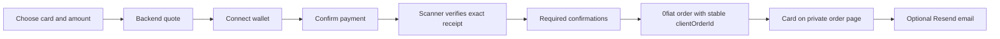

# Zucchini Store

A gift-card storefront at **store.zucchinifi.xyz**, paid in Zcash through
`@zucchinifi/dapp-sdk`. The selected provider is Cryptorefills, the merchant of
record. Historical 0fiat orders retain their prepaid reseller flow. The store is
separate from the wallet, gateway and merchant-domain registry.

**Current launch state:** browse-only; direct customer-funded checkout is being
prepared. The selected flow is customer ZEC → swap provider → invoice USDC
directly to Cryptorefills. No merchant buffer or receipt collector is needed for
that route. Reviewed provider responses, exact-output execution, wallet expiry,
refund handling and a direct coordinator still block real-funds testing.

## Cryptorefills migration

The direct flow supersedes the earlier disabled buffered proposal. Pure invoice,
recipient and quote checks do not create orders or move funds. Provider HTTP
requests bind idempotency, email and trusted customer IP, support one backup-key
failover on 401, and stop repeat requests during a 429 cooldown. See the
[direct architecture](docs/direct-payment.md) and
[reviewed provider contract](docs/cryptorefills-contract-review.md).
Wallet connection uses the Zucchini SDK and remains separate from payment.
Mock tests do not establish live API compatibility or funded delivery.

## Run

Use Node 22.19 (the lockfile and CI pin the runtime):

```sh
npm ci
cp .env.example .env
# Configure OFIAT_ENV_FILE with a private file containing API_KEY and API_SECRET.
npm run catalog:sync
npm run build
npm run dev
```

Open `http://127.0.0.1:4390`. The default is browse-only. Production payments
require HTTPS and every readiness gate. Never put credentials in browser code.
The cached catalog is private and ignored by Git. Its permitted public fields
are filtered by the API. Both fixed denominations and flexible amounts work.
Search, country selection, brand grouping, issuer options and pagination operate
on the cached catalog, rather than spending provider catalog quota per visitor.

## SDK integration

The page imports `createZucchiniClient` and `discoverZucchiniProvider` from
`@zucchinifi/dapp-sdk/zcash`. Connect requests `send_transaction` permission only.
It checks the wallet network before payment. Connect and Pay are separate user
actions. The backend determines the recipient, amount and unique memo and creates
an ordinary ZIP-321 request. This uses Wallet 0.5.2's ordinary payment support;
it does not claim verified merchant-registry enrollment or silently substitute
an unsigned request for a rejected signed invoice.



A browser-reported transaction ID is submission information only. Backend
receipt reconciliation imports the SDK's merchant receipt functions; the local
collector uses `@zucchinifi/zcash-scanner`. Neither module derives a spending key
from a user's seed phrase.

## Deployment

`wrangler.jsonc` targets an independent Cloudflare Worker and SQLite-backed
Durable Object. It owns the store subdomain only. See [operations](docs/operations.md)
for secrets, catalog publication, scanner setup, failure handling and activation.
The Node server is a local development adapter over the same API/domain code.
Pushes run CI; deployment is a manual GitHub workflow, with a production
environment. There is no push-to-main production deployment.

## What is covered

- Cached, provider-backed catalog and server-side signed quotes.
- Decimal USD math, rounded-up zatoshis, maximum purchase limit, fresh exchange
  rates, price lock, funding reservations and stale-catalog/scanner gates.
- Durable encrypted orders and card details; hashed access capabilities.
- Separate Connect/Pay and no automatic replay of a wallet request.
- Receipt amount, recipient, invoice memo, canonical block depth, replay and
  sequence checks; stale, late, underpaid, overpaid and reorg states.
- Provider order recovery with the same idempotent client reference.
- Digital delivery and optional idempotent Resend email; no newsletter enrollment.
- Private saved order links, reload recovery, cancel-before-payment, refund review
  and operator audit records. The app cannot spend Zcash to issue a refund.
- Responsive storefront, keyboard dialog focus, status updates and copied feedback.
- Daily catalog refresh on Cloudflare; provider ordering/status polling uses alarms.

## Checks

```sh
npm run check
npm test
npm run build
npm exec wrangler -- deploy --dry-run
npm audit
```

Tests cover an HTTP checkout through receipt and mock delivery, encrypted
persistence, provider recovery, duplicate fulfillment protection, stale/reorg
receipts, monetary bounds, and email opt-in/retry behavior. Real gift-card
fulfillment, real email delivery and a funded Zcash checkout remain launch gates.

Code is MIT licensed. Branding and provider catalog/artwork retain their own
rights. This repository intentionally contains no real gift-card codes, private
catalog export, provider credentials, viewing keys or scanner binaries.
