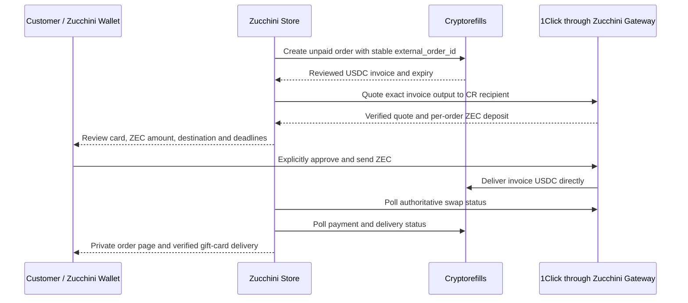

# Direct customer-funded Cryptorefills payment

Status: selected architecture, awaiting reviewed invoice compatibility. Checkout
and fulfillment remain disabled. Store configuration now selects `direct_swap`;
runtime readiness reports its own blockers and does not compose merchant-buffer
adapters. Pure invoice/quote/account guards and read-only Cryptorefills catalog
transport are prepared. The direct checkout coordinator, live response mappings
and payment approval flow are still absent. Historical buffered source remains
for its original orders. No live Cryptorefills order or funded swap has been tested.

## Funds and responsibilities

The customer approves one ZEC transaction from Zucchini Wallet to the swap
provider's per-order deposit address. The swap provider delivers native Solana
USDC directly to the exact Cryptorefills invoice recipient. Zucchini Store
coordinates the order and verifies progress; it receives neither the customer's
ZEC nor the invoice USDC and has no spending authority over either.

The direct path requires no merchant receiver, incoming viewing key, private
receipt collector, merchant USDC buffer, operator Solana transaction, merchant
outgoing ZEC evidence, or shielded recovery transfer. The private order page and
Cryptorefills delivery email provide recovery. Existing buffered orders must keep
their original funding mode, recipients, evidence and recovery rules; deployment
must never reinterpret them as direct orders.

## Invoice and quote binding

Create the Cryptorefills order before offering a payable ZEC quote. Persist an
attempt before the external POST and recover using the same `external_order_id`.
A reviewed response mapper must establish the exact provider order ID, external
order ID, product, denomination, beneficiary email, supported coin/network,
positive atomic USDC amount, recipient and expiry. These are internal evidence
requirements, not asserted `/v6` field names.

Only native Circle USDC on Solana mainnet is in this proposed route: mint
`EPjFWdd5AufqSSqeM2qN1xzybapC8G4wEGGkZwyTDt1v`, six decimals, original SPL Token
program. The gateway asset is
`nep141:sol-5ce3bf3a31af18be40ba30f721101b4341690186.omft.near`.
Determine whether the invoice address is a wallet owner, associated token account
or other deposit account before constructing the quote or verifying payment.
Those addresses are not interchangeable. Confirm that Cryptorefills accepts a
swap provider's on-chain payment against the selected whitelabel payment method,
and that any required payment reference can be supplied by the route. A required
unsupported memo, payer identity or payment reference blocks this route.

Use an exact-output swap for the provider's atomic invoice amount. The gateway now
accepts optional `EXACT_OUTPUT` for previews, with signature/echo and fixed-output
tests. This preview addition is local source work, not a verified live rollout.
Exact-output execution is explicitly blocked before provider I/O. Ordinary
swaps retain their existing exact-input default. Padding a fiat-derived ZEC amount
would not guarantee the invoice payment and can create underpayment or excess
USDC at CR.
The [official 1Click quote reference](https://docs.near-intents.org/api-reference/oneclick/request-a-swap-quote)
documents `EXACT_OUTPUT`, with fixed output, input slippage allowance and unused
input returned to the origin refund address. Enabling execution requires reviewed
gateway recovery, deadline and client changes; a configuration change cannot
enable it.

Persist the requested recipient/refund addresses, exact assets, invoice amount,
ZEC input limit, fees, provider quote identity/signature, gateway order ID, deposit
address and deadlines together. Validate gateway integrity, quote mode, amounts
and identities before presenting payment. Recover an ambiguous quote creation
through a stable attempt reference; never offer a new payable quote merely
because the previous request timed out. The gateway currently has no client
idempotency key or lookup by an external attempt ID.

The customer ZEC total must come from this executable quote. The current
CoinGecko-based `priceOrder` and retained merchant-margin policy do not price a
direct payment. Any store commission or gateway fee needs a documented,
disclosed mechanism that does not route invoice funds into a merchant buffer.

## Wallet approval and expiry

Current gateway source supports only mainnet transparent `t1`/`t3` Zcash deposit
and refund addresses. A customer's shielded reply address cannot serve as this
route's refund address. Obtain the customer's wallet-owned transparent address
with explicit `view_addresses` permission, or an explicitly confirmed address
with appropriate validation. The SDK provider's `getAddresses` supports this;
the published SDK wrapper does not yet expose a typed address helper. Do not use
the merchant's refund address as a fallback.

Connection and payment remain separate customer actions. Current
`@zucchinifi/dapp-sdk/zcash` can request an ordinary `zcash:` payment URI for the
deposit, with the quoted amount and no memo. The existing store `paymentUri`
always includes an order memo and cannot be reused: the wallet explicitly rejects
memos to transparent recipients. Reject a gateway ZEC quote requiring an
unsupported deposit memo. Do not automatically reconnect, approve, resend or
replay a persisted payment request.

Bind payment approval to both deadlines. The gateway currently chooses a
ten-minute deposit deadline; CR invoice expiry and accepted arrival/confirmation
rules must leave an adequate settlement window. Define a latest approval time
from both windows and reviewed timing policy, and revalidate before approval.
The ordinary wallet URI method currently gives its approval ten minutes from
request time, irrespective of the quote's remaining time. A quote-bound wallet
approval/expiry capability is needed to prevent a delayed approval after the
swap deadline. Existing verified merchant invoices advertise
`single-shielded-zec` and cannot stand in for a transparent swap deposit.

If wallet-side quote signature verification is added, the gateway must return
the complete canonical signed quote material: its existing normalized response
and signature alone omit fields needed to reconstruct the provider's signed
message. Preserve the legacy swap request/response contract when adding these
capabilities; current API validators require exact fields, and existing extension
order validation assumes the requested amount equals quote input.

## Authoritative states and evidence

Use a separate direct-payment coordinator, with durable states equivalent to:

1. `provider_order_requested` / `provider_invoice_ready`: persist creation and
   bind the reviewed, still-unpaid CR invoice.
2. `swap_quote_requested` / `awaiting_customer_deposit`: persist quote creation,
   then bind the verified gateway order before publishing its deposit address.
3. `customer_approval_requested` / `deposit_submitted`: persist the attempt before
   requesting the wallet. Store a returned txid only as a submission reference.
   Uncertain wallet results require status reconciliation, not another send.
4. `swap_processing`: poll the stored gateway order under the same installation
   identity. The gateway checks provider correlation ID; its Explorer fallback
   additionally matches the stored deposit, assets, recipient and refund tuple.
5. `provider_payment_review` / `awaiting_delivery`: gateway `SUCCESS` identifies
   candidate destination transactions. Independently verify finalized Solana
   evidence against exact invoice recipient/account, USDC identity and amount,
   then require the CR order's authoritative payment acceptance. A browser txid,
   balance increase, gateway notification `accepted`, or a generic success label
   alone does not establish this purchase.
6. `delivered`: only a reviewed CR delivery response matching both order IDs,
   beneficiary, product, country and denomination can attach card details to the
   encrypted order and publish them through its private recovery token.

Unknown states, identity changes, contradictory evidence, underpayment, late
arrival or expiry enter `support_required` or `refund_review`. They do not create
a replacement payment automatically. Enforce unique gateway orders, provider
orders and credited destination transaction/output references across purchases.
Safe status and delivery reads continue without the customer's browser. A
validated duplicate webhook may wake reconciliation, but cannot bypass the same
evidence checks; webhook verification must use the documented signing contract.

The existing read-only Solana transport can fetch finalized evidence without a
buffer or signing wallet. Its verifier currently accepts a single exact
`TransferChecked` and net credited recipient balance. Review actual swap payout
transactions and CR account ownership; add other transaction shapes only with
specific authoritative fixtures and tests. Do not apply the buffered top-up
verifier's merchant-source or exact serialized merchant transaction requirement
to a provider payout.

## Refund and cancellation boundaries

Before any customer deposit, cancel only when authoritative CR evidence says no
payment has been detected and its API permits cancellation. Do not assume a
locally expired quote proves that payment never happened. Persist cancellation
attempts and reconcile uncertain responses. Leave abandoned swap deposits unused
and reconcile any unexpected late activity.

Swap failure, incomplete deposit or excess-input refunds belong to the customer
at the immutable origin-chain refund address. Record authoritative refund status,
amount, fee and available transaction evidence; never report a refund as complete
from a customer assertion. Returned ZEC is transparent on the present route and
the wallet may shield it afterward. Store does not send that refund.

A CR refund after successful USDC delivery follows a separate customer recovery
route. The [official refund form guide](https://www.cryptorefills.com/en/help/refunds/submit-wallet)
says the refund email links to a form where the customer supplies a wallet they
control on the original payment coin/network; claims expire after 90 days. For
this route that means a compatible customer-controlled Solana USDC address,
not the swap provider's apparent sender. The selected recovery plan is this
customer email/form flow, subject to confirmation that `/v6` whitelabel orders
use it with the real customer's delivery email.

Cryptorefills support decides whether the outcome is a crypto refund or a coupon,
according to its [refund destination guide](https://www.cryptorefills.com/en/help/refunds/where-refunds-go).
Its [timing guide](https://www.cryptorefills.com/en/help/refunds/timeline) describes
straightforward cases as usually processed within one business day after the
address is supplied. These are provider procedures, not store refund guarantees.
A CR `REFUNDED` state neither proves customer receipt nor converts USDC back to
ZEC. Confirm partner applicability, fees and refund evidence before activation;
show unresolved cases as support review. Any reverse swap is a separate explicit
customer action. A merchant custody fallback is outside this selected path.

## Customer data and consent

Keep the required delivery email, real transport-derived customer IP and separate
unchecked CR terms/privacy acceptances. Forward IP only from the trusted server
or Cloudflare boundary, not a caller-supplied forwarded header. Explain that CR
receives email/IP/product details and the swap provider receives routing and
refund information. Preserve the required provider label/logo in the purchase
flow and do not silently enroll the customer in marketing.

Explain the conversion, quoted amount, fee/slippage allowance, deadlines and
refund route before wallet approval. The ZEC deposit/refund receiver and outgoing
USDC payment are public chain data; do not describe the full route as shielded.
Request no balance access, seeds, spending keys or viewing keys. Retain encrypted
order storage, limited public status fields, secret private recovery tokens and
log redaction for email, IP, card data, tokens and credentials.

## Implementation and activation gaps

`src/direct-payment.mjs` validates internal mapped invoices and immutable recovery
IDs, mainnet transparent address checksums, native USDC identity, finalized account
evidence and canonical ATA ownership. Its pure quote binder requires an exact
invoice output, bounded ZEC input, the verified provider owner as swap recipient,
an explicit absent deposit memo and configurable approval/settlement windows. Its
URI helper creates only a memo-free Zcash request before the approval cutoff.
These guards perform no network call and do not map raw `/v6` response fields or
provide a checkout state machine. Their tests use synthetic internal evidence;
they establish contract rejection behavior, not upstream API interoperability.
The normalized quote integrity assertion must come from the trusted gateway
adapter, and account evidence from the server's authoritative RPC adapter.

- Reviewed `/v6` invoice, pricing, payment acceptance, delivery, cancellation and
  refund mappings; exact CR catalog products and payment-method compatibility.
- Gateway exact-output execution, immutable invoice binding, deadline coupling
  and durable creation recovery. Preview validation is implemented; payable
  execution remains gated. Keep current ordinary swaps backward compatible.
- Renewable gateway sessions with a stable installation identity owned by the
  store backend. Sessions last fifteen minutes; a static session token cannot
  support long-running orders. The existing challenge mechanism uses an
  installation Ed25519 key, not a wallet spending key. Review app allowlisting and
  credential storage; never export an extension session or installation secret.
- Typed wallet refund-address access and quote-bound approval/expiry, with explicit
  connect-then-pay behavior and recovery after interrupted submissions.
- A direct coordinator, direct checkout pricing/URI/evidence, readiness checks and
  background reconciliation. Direct readiness must not depend on the merchant
  scanner heartbeat. Preserve historical buffered orders and existing encryption.
- Exact finalized payout fixtures, CR refund beneficiary/recovery contract,
  customer disclosures, monitoring and a separately reviewed capped acceptance.

Relevant existing sources: `src/application.mjs`, `src/config.mjs`,
`src/domain.mjs`, `src/direct-payment.mjs`, `src/gateway-adapter.mjs`, `src/runtime-settlement.mjs`,
`src/cryptorefills-provider.mjs`, `src/cryptorefills-settlement.mjs`,
`src/solana-rpc.mjs`, `src/solana-settlement.mjs`;
`../gateway/src/swap.rs`, `../gateway/src/swap/order.rs`,
`../gateway/src/auth.rs`, `../gateway/src/config.rs`;
`../dapp-sdk/src/zcash.ts`, `../dapp-sdk/src/merchant.ts`;
`../web/packages/api-client/src/index.ts`,
`../web/apps/extension/lib/dapp-controller.ts`,
`../web/apps/extension/lib/dapp-payment-uri.ts`,
`../web/apps/extension/lib/gateway-session.ts`, and
`../web/apps/extension/lib/swap-order-store.ts`.

No source activation, gateway deployment, credential access, live order, wallet
connection or payment is performed by adopting this document.
